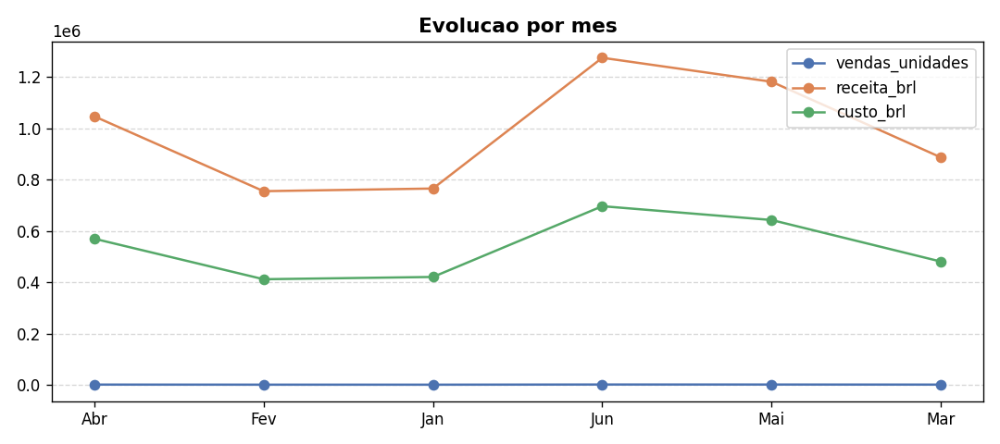
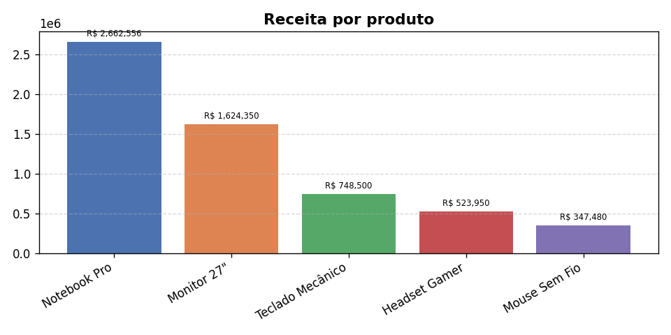
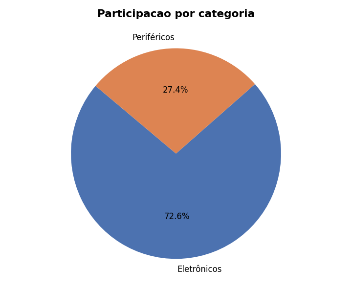
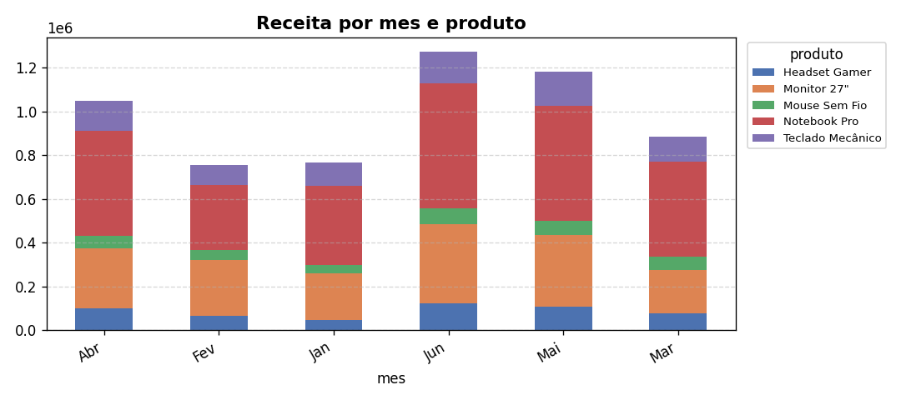

# Projeto 5 — Relatório Executivo com Dados + IA

Carrega um CSV com **Pandas**, realiza análise estatística completa e usa a **API Gemini** para gerar um relatório executivo em Markdown — combinando o poder dos dados com inteligência artificial.

## O que o script faz

1. Carrega qualquer CSV com Pandas
2. Calcula automaticamente: dimensões, tipos, nulos, estatísticas descritivas, correlações e agregações por categoria
3. Envia o resumo analítico para o Gemini 2.5 Flash
4. Recebe um relatório executivo estruturado em Markdown
5. Salva o relatório como `.md` com timestamp

## Estrutura do relatório gerado

- **Sumário Executivo**
- **Principais Métricas** (KPIs)
- **Análise por Segmento** (categoria, região, período)
- **Tendências Identificadas**
- **Pontos de Atenção** (riscos e oportunidades)
- **Recomendações** (ações concretas)
- **Próximos Passos**

## Como usar

```bash
pip install pandas matplotlib google-genai python-dotenv
python projeto5_relatorio.py
```

Digite o caminho do seu CSV ou pressione **Enter** para usar o `vendas_exemplo.csv` incluído.

Você também pode informar um **foco específico** para o relatório — por exemplo: _"foco em desempenho regional"_ ou _"analise a sazonalidade"_.

## Arquivo de exemplo

`vendas_exemplo.csv` contém dados fictícios de vendas de produtos de tecnologia (Jan–Jun), com colunas:

| Coluna | Descrição |
|---|---|
| mes | Mês da venda |
| produto | Nome do produto |
| categoria | Categoria do produto |
| vendas_unidades | Quantidade vendida |
| receita_brl | Receita em R$ |
| custo_brl | Custo em R$ |
| regiao | Região do Brasil |

## Gráficos gerados automaticamente

O script detecta o tipo de dados e gera até 4 gráficos em PNG dentro de uma pasta `graficos_<nome>_<timestamp>/`:

| Gráfico | Condição |
|---|---|
| Linha — evolução temporal | coluna com nome `mes`, `data`, `ano`, etc. |
| Barras — métrica por categoria | coluna categórica com ≤ 20 valores únicos |
| Pizza — distribuição | segunda coluna categórica disponível |
| Barras empilhadas | tempo + categoria simultaneamente presentes |

Os links `` são inseridos automaticamente ao final do relatório `.md`.  
O texto do relatório também menciona os gráficos nas seções relevantes (gerado pela IA).

### Exemplos de gráficos gerados









## Requisitos

- Python 3.10+
- Arquivo `.env` com `GEMINI_API_KEY`
- `pip install pandas matplotlib google-genai python-dotenv`
